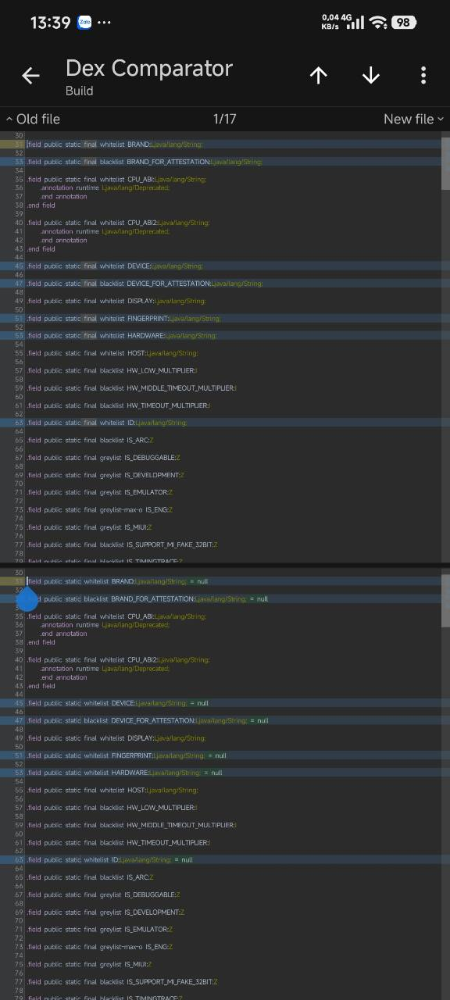
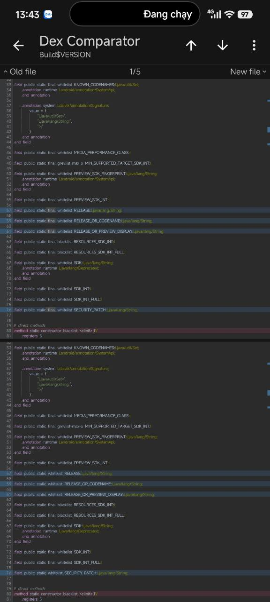

# Android 17 note — make selected `Build` fields writable

This patch is **required on Android 17+** and has been tested on HyperOS 4
Beta. Android 17 blocks Java writes to `static final` fields through both
`Field.set()` and `sun.misc.Unsafe.putObject()`. Kaorios therefore cannot spoof
the selected `Build` properties until the ROM removes their `final` access
flag.

## Location

Patch the DEX inside `framework.jar` that contains:

```smali
Landroid/os/Build;
Landroid/os/Build$VERSION;
```

On the tested HyperOS Android 17 build both classes are in `classes3.dex`, but
the DEX number can differ by ROM. Locate the classes instead of assuming a
fixed number.

## Fields to patch

Remove `final` only from these declarations:

Minimum set used by built-in Photos and common PIF profiles:

```text
Build.smali        : BRAND DEVICE FINGERPRINT HARDWARE ID MANUFACTURER MODEL
                     PRODUCT TAGS TIME TYPE USER
Build$VERSION.smali: RELEASE RELEASE_OR_CODENAME RELEASE_OR_PREVIEW_DISPLAY
                     SECURITY_PATCH DEVICE_INITIAL_SDK_INT
```

Also remove `final` from any additional Build field explicitly present in the
selected PIF/game profile, including `DISPLAY`, `HOST`, `INCREMENTAL`, `SDK`, or
`*_FOR_ATTESTATION` when used. Do not change `SDK_INT` casually.

Keep the field name, type, visibility, and hidden-API modifier (`whitelist`,
`greylist`, etc.) unchanged.

## Expected Dex Comparator result

<p align="center">
  
</p>

<p align="center">
  
</p>

The examples compare the original DEX (top) with the patched DEX (bottom):

- In `Build`, highlighted fields such as `BRAND`, `DEVICE`, `FINGERPRINT`,
  `HARDWARE`, and `ID` no longer contain `final`; this rebuild tool also
  displays an explicit `= null` initializer.
- In `Build$VERSION`, `RELEASE` and `SECURITY_PATCH` no longer contain `final`
  and are displayed without an initializer. Nearby fields such as
  `RELEASE_OR_CODENAME`, `RELEASE_OR_PREVIEW_DISPLAY`, `SDK`, and `SDK_INT`
  remain unchanged.

The essential change is removal of `final`:

```smali
# Before
.field public static final whitelist BRAND:Ljava/lang/String;

# Valid after form
.field public static whitelist BRAND:Ljava/lang/String;
```

Some smali editors or DEX rebuild tools serialize certain non-final reference
fields with an explicit null initializer. This output is valid and matches the
`Build` comparison:

```smali
.field public static whitelist BRAND:Ljava/lang/String; = null
.field public static whitelist DEVICE:Ljava/lang/String; = null
.field public static whitelist FINGERPRINT:Ljava/lang/String; = null
.field public static whitelist HARDWARE:Ljava/lang/String; = null
.field public static whitelist ID:Ljava/lang/String; = null
```

`= null` is only the default value before class initialization. It does not
force the property to remain null and does not replace the value assigned by
the original class initializer. The `Build$VERSION` comparison confirms that a
valid patched field may also have no explicit initializer. Do not manually add
or remove `= null`; removing `final` is the required part.

Do not modify unrelated nearby fields merely because they are visible in the
comparator. A field outside the minimum list should change only when the active
profile writes that exact field.

## Rebuild and verification

Reassemble with smali 3.x using `--api 29` or higher so hidden-API modifiers
remain valid. After rebuilding:

1. Open the rebuilt DEX in a comparator and confirm each selected field no
   longer contains `final`.
2. Confirm unrelated fields and the original class initializer were not
   changed.
3. Boot the ROM and verify normal `Build` values are populated.
4. Enable a Kaorios PIF/GPhotos profile and verify only configured processes
   receive spoofed values.

No method register changes are needed for this field-only patch. Default values
remain unchanged for processes that are not configured for spoofing.
